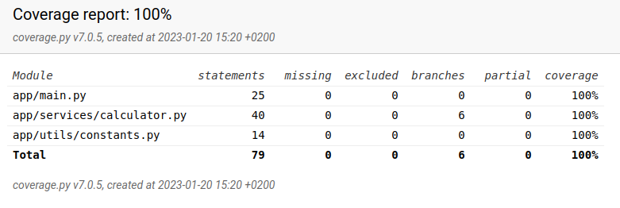

# Wolt Summer 2023 Engineering Intern Assignment

## About the project :computer:

This is my solution for Wolt Summer 2023 Engineering Intern [assignment](https://github.com/woltapp/engineering-summer-intern-2023). The purpose of this app is to determine the delivery price for customer.

* This solution was built using Python.
* Calculations for delivery fee run in O(1) time complexity.

#### Libraries :books:
* [Poetry](https://python-poetry.org/) for managing dependencies and packaging.
* [Invoke](https://www.pyinvoke.org/) for automating tasks on command line.
* [FastAPI](https://fastapi.tiangolo.com/) library to construct an HTTP API.
* [NumPy](https://numpy.org/) and [datetime](https://docs.python.org/3/library/datetime.html) to calculate the delivery fees.
* [Mypy](https://mypy-lang.org/) for checking typing.
* [Flake8](https://flake8.pycqa.org/en/latest/) for code analyzing
* [Black](https://pypi.org/project/black/) for auto-formatting.
* [Unittest](https://docs.python.org/3/library/unittest.html) for testing.

#### Other things to note :pencil2:
* Continuous integration is enabled by Github Actions.
* Additional validations have been implemented:
  * The values for cart_value, delivery_distance, and amount_of_items must be positive numbers (greater than 0) and the input data must be in a proper format for all variables.
 &rarr;  If the input data is of an incorrect type, an error message will be displayed.

## Usage :wrench:

##### Prerequisites
* Python 3.9 or later
* Poetry

#### Install dependencies & Run the app

Install the dependencies:
```
poetry install
```

Activate the poetry environment:
```
poetry shell
```
Run the server:
```
poetry run invoke start
```

The API documentation is available at http://127.0.0.1:8000/docs.


#### Testing :telescope:

100% of the code has been tested. Below is a screenshot of the coverage report and commands to run and view the tests.




Test the app:
```
poetry run invoke test
```

Create coverage html:

```
poetry run invoke coverage
```

Get coverage report:

```
poetry run invoke coverage-report
```

View report on Firefox browser:

```
poetry run invoke coverage-view
```

#### Other useful commands :blue_heart:

Check typing:

```
poetry run invoke mypy
```
Generate a code analysis:


```
poetry run invoke flake
```


Auto-format the code

```
poetry run invoke black
```